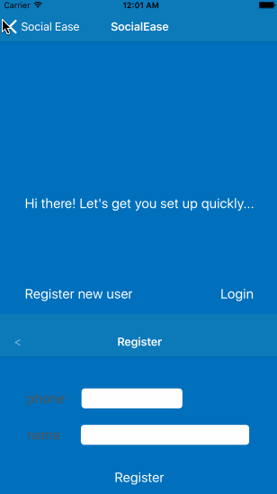

# SocialEase

## Problem Statement

* This 15 seconds video sums it all up:  https://goo.gl/Lu8E0U 
* Currently, it is very cumbersome to plan, organize and co-ordinates even a small hangout with your friends or family. You have to juggle around between different apps such as a messaging app to create start a dialog with people in the group, search for possible venues using another app for place discovery, then coordinate and follow up with everyone to make sure everyone know the plan and then use a payment app to add everyone's share.

## Idea Overview

Based on problem statement above, we want to streamline the whole process and make the planning easy by automating it. The app will not just take care of automating the planning part of the activity but also provide relevant updates to the group as the activity is happening. More details are listed below as features.

## Feature list:

#### Required

* An coherent experience on activity planning where user have minimal input and the app does most of the heavy lifting
* Create an activity with suggested time and place and send out request to people in group
 * Activity/place recommendation based on group’s preferences and common historical activity
* View active and archived activities to be able to view more details on each of them
 * Sometimes it happens that you go a place with your friend and you really liked but few weeks later you can not remember the place. Well not any more, as you can go to archive and view all the details about the place. 
* Respond to an activity request with "Thumbs Up" & "Thumbs Down" interface
* Chat conversation with the activity

### Strech Goal

* Provide relevant status updates to the group about other members
* Recommendation on suggested time to start an activity based on current traffic data and each individual’s current location
* Share content (photos/videos etc.) within the group

### Walkthrough
